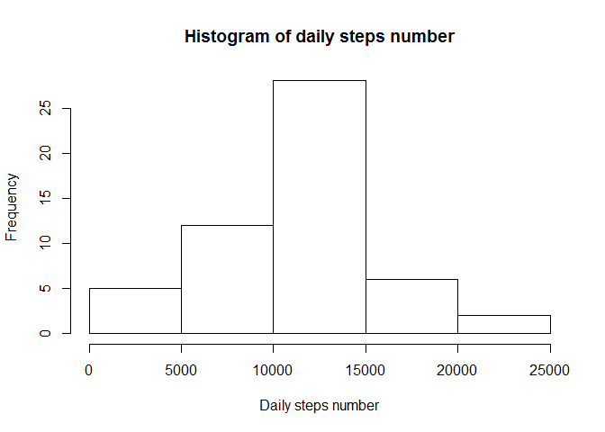
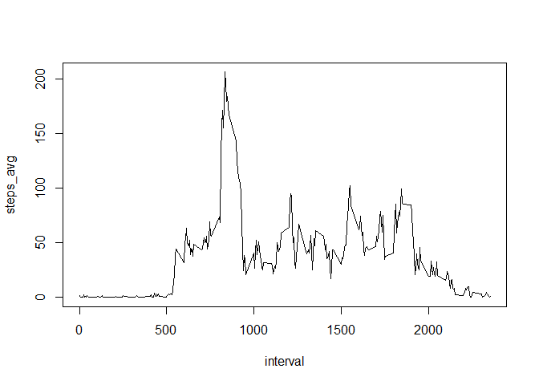
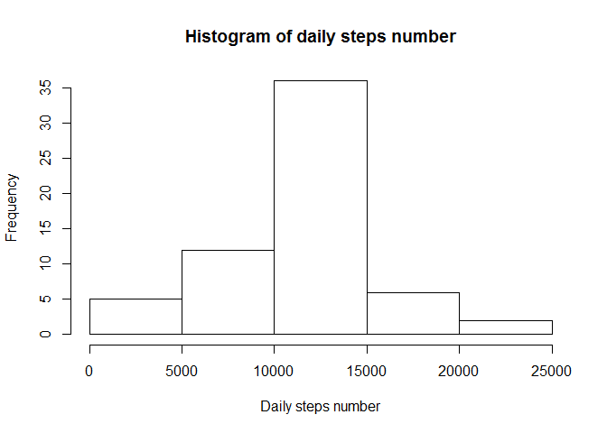
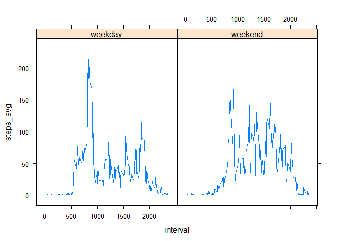

# Reproducible Research week2


Load the dataset in dataframe activity


```r
activity<- read.csv("./activity.csv")
```

# 1. What is mean total number of steps taken per day?


```r
options(scipen = 1, digits = 2)

# remove NA value
activity1<-subset(activity,!is.na(activity$steps))
# summurie steps number per day
steps<-activity1 %>%
  group_by(date) %>%
  summarize(steps_num=sum(steps))
# plot histogram
hist(steps$steps_num,main="Histogram of daily steps number",xlab="Daily steps number")
```

<!-- -->

```r
# calculate mean value
steps_mean <-mean(steps$steps_num)
steps_median<-median((steps$steps_num))
```

### The mean value of total number steps taken per day is **10766.19**
### The median value of total number steps taken per day is **10765**


# 2. What is the average daily activity pattern?


```r
options(scipen = 1, digits = 2)
# remove NA value
activity1<-subset(activity,!is.na(activity$steps))
# summurie steps number per day
intervals<-activity1 %>%
  group_by(interval) %>%
  summarize(steps_avg=mean(steps))
# plot time series
with(intervals,plot(interval,steps_avg,type = "l"),ylab="average number of steps")
```

<!-- -->

```r
# calculate mean value
maks_steps <-intervals[which.max(intervals$steps_avg),1]
```

### The interval with maximum number of average across all the days is **835**

# 3. Imputing missing values


```r
options(scipen = 1, digits = 2)
# calculatenumber of  NA value
na_number<-sum(is.na(activity$steps))
# replece missing values with average number of steps takenin interval
# use ceilling function to get integer numer of steps
temp <-merge(activity,intervals,by="interval")
activity_new <- temp %>%
      mutate(steps = ifelse(is.na(steps),ceiling(steps_avg),steps)) %>% 
      select(steps,date,interval) %>% 
      arrange(date,interval)
# summurie steps number per day for new dataset
steps_new<-activity_new %>%
  group_by(date) %>%
  summarize(steps_num=sum(steps))
# plot histogram
hist(steps_new$steps_num,main="Histogram of daily steps number",xlab="Daily steps number")
```

<!-- -->

```r
# calculate mean value
steps_mean_new <-mean(steps_new$steps_num)
steps_median_new<-median((steps_new$steps_num))
```

### total number of missing values in the dataset is **2304**
### The mean value of total number steps taken per day is **10784.92**
### The median value of total number steps taken per day is **10909**
### The mean value differ from the estimates from orginal  **18.73**
### The median value differ from the estimates from orginal  **144**
### The total number of steps differ from the estimates from orginal  **-87272**


# 4. Are there differences in activity patterns between weekdays and weekends?


```r
options(scipen = 1, digits = 2)
# add column with name of weekday
activity_new <- activity_new %>%
      mutate(weekday = weekdays(as.Date(date),abbreviate = TRUE))
#change to a factor
activity_new$weekday<-as.factor(activity_new$weekday)
#change levels in factor
levels(activity_new$weekday)= list(weekday= c("Pn","Wt","Śr","Cz","Pt"), weekend = c("So","N"))
intervals_day<-activity_new %>%
  group_by(interval,weekday) %>%
  summarize(steps_avg=mean(steps))
xyplot(steps_avg~interval|weekday,intervals_day,type='l')
```

<!-- -->
